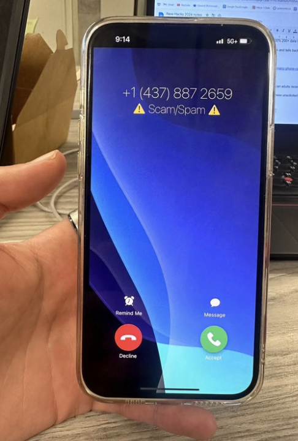

## Inspiration

I'm sitting in class, just another day of being an academic weapon when suddenly SPAM! My phone starts ringing. I don't want to pick up, but what if it is something important, like my doctor calling. So I rushed out, answered it, just to be met with "You have won a trip to the Bahamas".

## What it does

CallGuard is a revolutionary AI integration at the telecom level that leverages the power of LLMs to protect users from scam, spam, and fradulent calls, all in real time It acts as a personal assistant filtering out spam phone calls. 

It listens to incoming calls, transcribes them in real time, and classifies them as legitimate or spam/scam. Instead of having to rush out the hallway, you can sit in class and accept the call. If it gets flagged as spam, it goes straight to your voice mail. 

And if it's legitimate, the system will let you know so that you can decide what to do.

## How we built it

Our full stack solution from user calls to logging is accomplished using our proprietary in house messaging and transaction infrastructure. 

All calls are passed through our server running in Flask which triggers API calls to OpenAI and WhisperAI. 

The response from the LLM is then evaluated and a status notification is updated on callee's phones.

## Challenges we ran into

Various SSL/TLS issues when attempting to create websockets, leading to build our own in house message queue to communicate between the user and our server.

## Accomplishments that we're proud of

We built and deployed an iOS clone which is can be viewed from any cellular device, adding realism to our integration in action to an end user.

## What we learned

We learned with the power of LLMs, many applications can be given immense computational power with limited infrastructure that needs to be set up manually. 

The heart of our project relies on using GPTs to perform the buik of our data processing that would otherwise have taken much longer than 24 hour to build.

## What's next?

Our next step is to evaluate privacy concerns and enhance our application to have more chatbot like features including responding to users similar to Bard (now Gemini), where every phone user now has a built in AI personal assistant answering calls for them. 

This allows end users to focus on what matters most in life, and need not spend time on meanial tasks in life.
